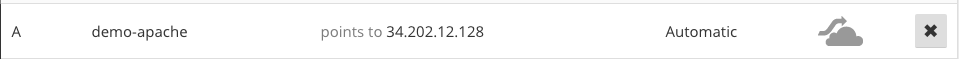

# Apache HTTP Server with TLS using Let's Encrypt 

This is a [website](https://demo-apache.chriswang.tech/) to demonstrate the setup of HTTPS service on an Apache HTTP Server using [Let's Encrypt](https://letsencrypt.org/).

Note: The website is purely for demonstration purpose and note suitable for production use.

## Steps
### Create EC2 instance
An AWS EC2 `t2.micro` instance is setup. And an elastic IPv4 address (`34.202.12.128`) is assigned and attached to the EC2 instance's network interface.

### Update DNS record

A DNS `A` record is added to my DNS for chriswang.tech and pointing to `34.202.12.128`. In my case, Cloudflare's DNS is used.

 The configuration is shown below.



The `dig` command is used to verify that the DNS record has taken effect in my local DNS resolver.

```bash
$ dig demo-apache.chriswang.tech
```

    ; <<>> DiG 9.8.3-P1 <<>> demo-apache.chriswang.tech
    ;; global options: +cmd
    ;; Got answer:
    ;; ->>HEADER<<- opcode: QUERY, status: NOERROR, id: 24626
    ;; flags: qr rd ra; QUERY: 1, ANSWER: 1, AUTHORITY: 2, ADDITIONAL: 4
    
    ;; QUESTION SECTION:
    ;demo-apache.chriswang.tech.	IN	A
    
    ;; ANSWER SECTION:
    demo-apache.chriswang.tech. 300	IN	A	34.202.12.128
    
    ;; AUTHORITY SECTION:
    chriswang.tech.		2811	IN	NS	art.ns.cloudflare.com.
    chriswang.tech.		2811	IN	NS	alice.ns.cloudflare.com.
    
    ;; ADDITIONAL SECTION:
    art.ns.cloudflare.com.	47841	IN	A	173.245.59.102
    alice.ns.cloudflare.com. 43742	IN	A	173.245.58.60
    art.ns.cloudflare.com.	47841	IN	AAAA	2400:cb00:2049:1::adf5:3b66
    alice.ns.cloudflare.com. 43742	IN	AAAA	2400:cb00:2049:1::adf5:3a3c
    
    ;; Query time: 72 msec
    ;; SERVER: 192.35.82.50#53(192.35.82.50)
    ;; WHEN: Wed Apr 26 18:32:27 2017
    ;; MSG SIZE  rcvd: 203


### Test HTTP
To verify the Apache HTTP service works, visit in the browser`http://demo-apache.chriswang.tech`.

An Apache Default Page below is expected.


### Update `index.html`

To update the default page, a custom `index.html` is created and symlinked to the default Apache directory at `/var/www/html/` using the following command:

`$ sudo ln -s ~/demo-apache/index.html /var/www/html/index.html`

The following webpage should be shown after refreshing the same URL in browser.


### Generate Private Key

The RSA private key and certificate signing request (CSR) are generated using `openssl` using the following command:

`$ openssl req -newkey rsa:2048 -nodes -keyout domain.key -out domain.csr`

The generated CSR will be used for the TLS public certificate generation in the next step.

### Configure Let's Encrypt/CertBot

In order to use Let's Encrypt, the CertBot is installed to automate this process using the following commands:
```bash
$sudo add-apt-repository ppa:certbot/certbot
$sudo apt-get update
$sudo apt-get install python-certbot-apache
```

The TLS certificate generation and Apache HTTP Server are executed automatically by running the following command:


```bash
$ certbot --apache 
```

If successful, an output similar to the following is expected:

    Saving debug log to /var/log/letsencrypt/letsencrypt.log
    No names were found in your configuration files. Please enter in your domain
    name(s) (comma and/or space separated)  (Enter 'c' to cancel):demo-apache.chriswang.tech
    Starting new HTTPS connection (1): acme-v01.api.letsencrypt.org
    Obtaining a new certificate
    Performing the following challenges:
    tls-sni-01 challenge for demo-apache.chriswang.tech
    Enabled Apache socache_shmcb module
    Enabled Apache ssl module
    Waiting for verification...
    Cleaning up challenges
    Generating key (2048 bits): /etc/letsencrypt/keys/0000_key-certbot.pem
    Creating CSR: /etc/letsencrypt/csr/0000_csr-certbot.pem
    Created an SSL vhost at /etc/apache2/sites-available/000-default-le-ssl.conf
    Enabled Apache socache_shmcb module
    Enabled Apache ssl module
    Deploying Certificate to VirtualHost /etc/apache2/sites-available/000-default-le-ssl.conf
    Enabling available site: /etc/apache2/sites-available/000-default-le-ssl.conf
    
    Please choose whether HTTPS access is required or optional.
    -------------------------------------------------------------------------------
    1: Easy - Allow both HTTP and HTTPS access to these sites
    2: Secure - Make all requests redirect to secure HTTPS access
    -------------------------------------------------------------------------------
    
    Select the appropriate number [1-2] then [enter] (press 'c' to cancel): 2
    Enabled Apache rewrite module
    Redirecting vhost in /etc/apache2/sites-available/000-default.conf to ssl vhost in /etc/apache2/sites-available/000-default-le-ssl.conf
    
    -------------------------------------------------------------------------------
    Congratulations! You have successfully enabled
    https://demo-apache.chriswang.tech
    
    You should test your configuration at:
    https://www.ssllabs.com/ssltest/analyze.html?d=demo-apache.chriswang.tech
    -------------------------------------------------------------------------------
    
    IMPORTANT NOTES:
     - Congratulations! Your certificate and chain have been saved at
       /etc/letsencrypt/live/demo-apache.chriswang.tech/fullchain.pem.
       Your cert will expire on 2017-07-25. To obtain a new or tweaked
       version of this certificate in the future, simply run certbot again
       with the "certonly" option. To non-interactively renew *all* of
       your certificates, run "certbot renew"
     - If you like Certbot, please consider supporting our work by:
    
       Donating to ISRG / Let's Encrypt:   https://letsencrypt.org/donate
       Donating to EFF:                    https://eff.org/donate-le

### Qualys SSL Report

To verify that the the HTTPS/TLS service is configured correctly, the [Qualys SSL Server Test](https://www.ssllabs.com/ssltest/analyze.html?d=demo-apache.chriswang.tech) is run. 

The test report is shown below with a big green **A**. It means the HTTPS/TLS is working as expected! 😀


## References

### Apache Web Server
*  Basic Setup: https://www.digitalocean.com/community/tutorials/how-to-configure-the-apache-web-server-on-an-ubuntu-or-debian-vps
*  Get Started Guide: 
   http://httpd.apache.org/docs/2.4/getting-started.html

### Let's Encrypt and Certbot
* Get started: https://certbot.eff.org/#ubuntuxenial-apache

